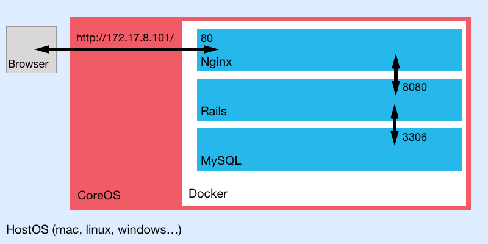

# Rails Environment with Docker on CoreOS

### Keywords

Vagrant / CoreOS / Docker / Ruby on Rails / MySql / Nginx

---

### Structure



---

### Development Environmemnt
Use below commands to build CoreOS environment with Vagrant into your mac.

```bash
$ git clone https://github.com/coreos/coreos-vagrant/
$ cd coreos-vagrant
$ vagrant up
$ vagrant ssh
```

### Git Config

```bash
$ git config --global user.email "matwumatwu@gmail.com"
$ git config --global user.name "matwu"
$ git clone https://github.com/matwu/rails-docker-coreos/ workspace
```

### Mysql
Build mysql image and run it

```bash
$ docker build -t matwu/mysql:0.0.1 /home/core/workspace/apps/mysql
$ docker run -d -e MYSQL_ROOT_PASSWORD=saruhashi --name matwu_mysql matwu/mysql:0.0.1
```

### Rails
Build rails image and run it

```bash
$ docker build -t matwu/rails:0.0.1 /home/core/workspace/apps/rails

# start rails container and start rails processes by foreman automatically.
$ docker run -d --link matwu_mysql:db --name matwu_rails matwu/rails:0.0.1
# start rails container and dive into it. the processes have to be started manually.
$ docker run -it --link matwu_mysql:db --name matwu_rails matwu/rails:0.0.1 /bin/bash
```

### Nginx
Build nginx image and build it

```bash
$ docker build -t matwu/nginx:0.0.1 /home/core/workspace/apps/nginx
$ docker run -d -p 80:80 -p 443:443 -v /home/core/workspace/mounts/log_nginx:/var/log/nginx --link matwu_rails:app --name matwu_nginx matwu/nginx:0.0.1
```

### Access to Rails App via Nginx from Browser
You can then go to [http://172.17.8.101/](http://172.17.8.101/) in a browser.  
Also you can see the access log at mounted directory.

```bash
tail -f /home/core/workspace/mounts/log_nginx/access.log
```


### Tips

```bash
# list of docker images stored in your OS
$ docker images

# list of docker containers and its status
$ docker ps -a

# stop all containers
$ docker stop `docker ps -q`

# remove docker container(s)
$ docker rm [container id]
$ docker rm `docker ps -aq`

# Remove Docker Image
$ docker rmi [image id]
```
